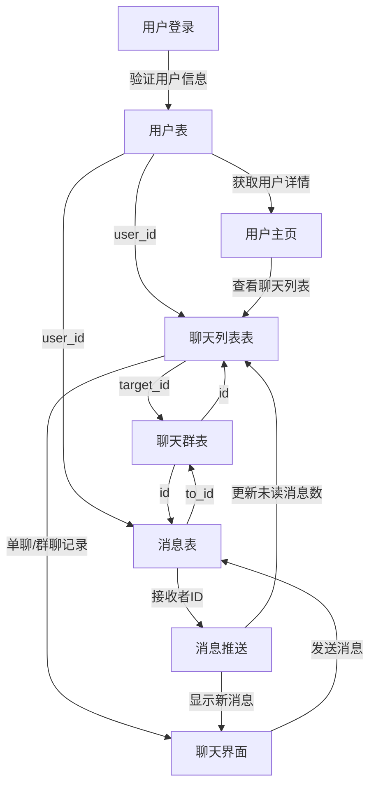

# Pixel Talk开发记录和规划的指导性文件

#### 设计

##### 表结构的设计

得思考完整的表结构，用mermaid来理清楚思路
数据库名字：pixeltalk
创建数据库：
```sql
CREATE DATABASE pixeltalk;
```
表最重要！！！注意id全部要设置为自增*ALTER TABLE chat_group MODIFY id INT AUTO_INCREMENT;*
运行前执行力sql文件，最后修改时间2025年1月15日18:49:50
```sql 
CREATE TABLE IF NOT EXISTS `user` (
                                      `user_id` INT PRIMARY KEY AUTO_INCREMENT COMMENT '用户ID',
                                      `username` VARCHAR(50) NOT NULL UNIQUE COMMENT '用户名',
                                      `password` VARCHAR(255) NOT NULL COMMENT '密码',
                                      `email` VARCHAR(100) NOT NULL UNIQUE COMMENT '邮箱',
                                      `phone` VARCHAR(20) UNIQUE COMMENT '手机号，唯一，可用于登录或接收验证码等',
                                      `nickname` VARCHAR(50) COMMENT '用户昵称',
                                      `avatar_url` VARCHAR(255) COMMENT '用户头像URL',
                                      `type` ENUM('普通用户', 'VIP用户', '管理员') DEFAULT '普通用户' COMMENT '用户类型，默认为普通用户',
                                      `badge` VARCHAR(50) COMMENT '徽章，用于标识用户特殊身份或成就',
                                      `login_time` TIMESTAMP COMMENT '最后一次登录时间',
                                      `create_time` TIMESTAMP DEFAULT CURRENT_TIMESTAMP COMMENT '用户创建时间，默认为当前时间',
                                      `update_time` TIMESTAMP DEFAULT CURRENT_TIMESTAMP ON UPDATE CURRENT_TIMESTAMP COMMENT '用户信息更新时间，自动更新为当前时间',
                                      `is_active` TINYINT(1) DEFAULT 1 COMMENT '是否启用，1 表示启用，0 表示封禁，默认为启用'
) COMMENT='多用户管理表';
CREATE TABLE IF NOT EXISTS `chat_group` (
    `id`          VARCHAR(255) NOT NULL COMMENT '群号',
    `name`        VARCHAR(255) NOT NULL COMMENT '聊天群名称',
    `avatar`      TEXT DEFAULT NULL COMMENT '聊天群头像URL',
    `create_time` TIMESTAMP(3) NOT NULL DEFAULT CURRENT_TIMESTAMP(3) COMMENT '聊天群创建时间',
    `update_time` TIMESTAMP(3) NOT NULL DEFAULT CURRENT_TIMESTAMP(3) ON UPDATE CURRENT_TIMESTAMP(3) COMMENT '聊天群更新时间',
    PRIMARY KEY (`id`)
    ) COMMENT='聊天群信息表';
CREATE TABLE IF NOT EXISTS `chat_list` (
    `id`           VARCHAR(255) NOT NULL COMMENT '聊天列表ID',
    `user_id`      VARCHAR(255) NOT NULL COMMENT '用户ID',
    `target_id`    VARCHAR(255) NOT NULL COMMENT '目标ID（用户ID或群组ID）',
    `target_info`  TEXT         NOT NULL COMMENT '目标信息（用户名或群组名称）',
    `unread_count` INT          DEFAULT 0 COMMENT '未读消息数',
    `last_message` TEXT         DEFAULT NULL COMMENT '最后一条消息内容',
    `type`         INTEGER DEFAULT NULL COMMENT '聊天类型（0单聊或1群聊）',
    `create_time`  TIMESTAMP(3) NOT NULL DEFAULT CURRENT_TIMESTAMP(3) COMMENT '创建时间',
    `update_time`  TIMESTAMP(3) NOT NULL DEFAULT CURRENT_TIMESTAMP(3) ON UPDATE CURRENT_TIMESTAMP(3) COMMENT '更新时间',
    PRIMARY KEY (`id`),
    INDEX `idx_chat_list_user_id_target_id` (`user_id`, `target_id`)
    ) COMMENT='聊天列表表';
CREATE TABLE IF NOT EXISTS `message` (
    `id`            VARCHAR(255) NOT NULL COMMENT '消息ID',
    `from_id`       VARCHAR(255) NOT NULL COMMENT '发送者ID',
    `to_id`         VARCHAR(255) NOT NULL COMMENT '接收者ID',
    `from_info`     TEXT         NOT NULL COMMENT '发送者信息（用户名或群组名称）',
    `message`       TEXT         DEFAULT NULL COMMENT '消息内容',
    `reference_msg` TEXT         DEFAULT NULL COMMENT '引用的消息ID',
    `at_user`       TEXT         DEFAULT NULL COMMENT '被@的用户ID',
    `is_show_time`  TINYINT(1)   DEFAULT 0 COMMENT '是否显示时间戳',
    `type`          VARCHAR(255) DEFAULT NULL COMMENT '消息类型（文本、图片、视频等）',
    `source`        VARCHAR(255) DEFAULT NULL COMMENT '消息来源（如群组ID）',
    `create_time`   TIMESTAMP(3) NOT NULL DEFAULT CURRENT_TIMESTAMP(3) COMMENT '消息创建时间',
    `update_time`   TIMESTAMP(3) NOT NULL DEFAULT CURRENT_TIMESTAMP(3) ON UPDATE CURRENT_TIMESTAMP(3) COMMENT '消息更新时间',
    PRIMARY KEY (`id`),
    INDEX `idx_message_from_id_to_id` (`from_id`, `to_id`)
    ) COMMENT='消息表';

-- 补充
ALTER TABLE chat_group MODIFY id INT AUTO_INCREMENT;
ALTER TABLE chat_list  MODIFY id INT AUTO_INCREMENT;
ALTER TABLE message  MODIFY id INT AUTO_INCREMENT;
ALTER TABLE message MODIFY COLUMN from_info VARCHAR(255) DEFAULT '';

```

##### 样例

```sql
INSERT INTO `message`(`id`, `from_id`, `to_id`, `from_info`, `message`, `reference_msg`, `at_user`, `is_show_time`, `type`, `source`, `create_time`, `update_time`) VALUES (1, '1', '2', 'Admin User', 'Hi there!', '1', NULL, 1, '文本', NULL, '2025-01-13 12:35:00.000', '2025-01-14 17:58:42.417');
INSERT INTO `message`(`id`, `from_id`, `to_id`, `from_info`, `message`, `reference_msg`, `at_user`, `is_show_time`, `type`, `source`, `create_time`, `update_time`) VALUES (2, '2', '1', 'VIP User', 'Hey, how\'s it going?', NULL, NULL, 1, '文本', NULL, '2025-01-13 12:40:00.000', '2025-01-14 09:39:58.140');
INSERT INTO `message`(`id`, `from_id`, `to_id`, `from_info`, `message`, `reference_msg`, `at_user`, `is_show_time`, `type`, `source`, `create_time`, `update_time`) VALUES (3, '1', '2', 'Regular User', 'Just started using the new AI tool, it\'s awesome!', NULL, NULL, 1, '文本', 'group1', '2025-01-13 13:05:00.000', '2025-01-14 09:39:58.853');
INSERT INTO `message`(`id`, `from_id`, `to_id`, `from_info`, `message`, `reference_msg`, `at_user`, `is_show_time`, `type`, `source`, `create_time`, `update_time`) VALUES (4, '0', '1', 'User Four', 'Yeah, I heard it\'s quite powerful.', NULL, NULL, 1, '文本', 'group1', '2025-01-13 13:10:00.000', '2025-01-14 09:39:59.794');
INSERT INTO `message`(`id`, `from_id`, `to_id`, `from_info`, `message`, `reference_msg`, `at_user`, `is_show_time`, `type`, `source`, `create_time`, `update_time`) VALUES (5, '2', '1', 'Admin User', 'Anyone got any good book recommendations?', NULL, NULL, 1, '文本', 'group2', '2025-01-13 14:05:00.000', '2025-01-14 09:40:01.785');
INSERT INTO `message`(`id`, `from_id`, `to_id`, `from_info`, `message`, `reference_msg`, `at_user`, `is_show_time`, `type`, `source`, `create_time`, `update_time`) VALUES (6, '1', '2', '', '傻逼', NULL, NULL, 0, NULL, NULL, '2025-01-14 18:13:14.145', '2025-01-14 10:13:14.148');
INSERT INTO `chat_group`(`id`, `name`, `avatar`, `create_time`, `update_time`) VALUES (1, 'Tech Enthusiasts', 'https://example.com/group1.jpg', '2025-01-13 11:00:00.000', '2025-01-14 07:33:38.643');
INSERT INTO `chat_group`(`id`, `name`, `avatar`, `create_time`, `update_time`) VALUES (2, 'Book Lovers', 'https://example.com/group2.jpg', '2025-01-13 11:30:00.000', '2025-01-14 07:33:39.869');
INSERT INTO `chat_group`(`id`, `name`, `avatar`, `create_time`, `update_time`) VALUES (3, 'Gaming Community', 'https://example.com/group3.jpg', '2025-01-13 12:00:00.000', '2025-01-14 07:34:01.023');
INSERT INTO `chat_group`(`id`, `name`, `avatar`, `create_time`, `update_time`) VALUES (4, '杨欢群', 'a.jpg', '2025-01-14 15:34:13.709', '2025-01-14 07:34:13.711');
INSERT INTO `user`(`user_id`, `username`, `password`, `email`, `phone`, `nickname`, `avatar_url`, `type`, `badge`, `login_time`, `create_time`, `update_time`, `is_active`) VALUES (1, 'admin', 'admin', 'admin@example.com', '1112223333', 'Admin User', 'https://example.com/admin.jpg', '管理员', '管理员', '2025-01-13 09:00:00', '2025-01-14 06:51:25', '2025-01-14 06:51:25', 1);
INSERT INTO `user`(`user_id`, `username`, `password`, `email`, `phone`, `nickname`, `avatar_url`, `type`, `badge`, `login_time`, `create_time`, `update_time`, `is_active`) VALUES (2, 'vipuser', 'vip123', 'vip@example.com', '2223334444', 'VIP User', 'https://example.com/vip.jpg', 'VIP用户', '尊贵VIP', '2025-01-13 09:30:00', '2025-01-14 06:51:25', '2025-01-14 06:51:25', 1);
INSERT INTO `user`(`user_id`, `username`, `password`, `email`, `phone`, `nickname`, `avatar_url`, `type`, `badge`, `login_time`, `create_time`, `update_time`, `is_active`) VALUES (3, 'user', 'user', 'user@example.com', '3334445555', 'Regular User', 'https://example.com/regular.jpg', '普通用户', '新手', '2025-01-13 10:00:00', '2025-01-14 06:51:25', '2025-01-14 06:51:25', 1);
INSERT INTO `user`(`user_id`, `username`, `password`, `email`, `phone`, `nickname`, `avatar_url`, `type`, `badge`, `login_time`, `create_time`, `update_time`, `is_active`) VALUES (4, 'inactiveuser', 'inactive123', 'inactive@example.com', '4445556666', 'Inactive User', 'https://example.com/inactive.jpg', '普通用户', '封禁用户', '2025-01-13 10:30:00', '2025-01-14 06:51:25', '2025-01-14 06:51:25', 0);
INSERT INTO `user`(`user_id`, `username`, `password`, `email`, `phone`, `nickname`, `avatar_url`, `type`, `badge`, `login_time`, `create_time`, `update_time`, `is_active`) VALUES (5, 'zxt', 'zxt', 'androidhtml@yandex.com', '1111', '朱孝天', NULL, '普通用户', NULL, NULL, '2025-01-14 18:08:54', '2025-01-14 10:08:53', 0);
INSERT INTO `user`(`user_id`, `username`, `password`, `email`, `phone`, `nickname`, `avatar_url`, `type`, `badge`, `login_time`, `create_time`, `update_time`, `is_active`) VALUES (6, 'a', 'a', 'a', 'a', NULL, NULL, '普通用户', NULL, NULL, '2025-01-14 18:09:14', '2025-01-14 10:09:14', 1);
INSERT INTO `chat_list`(`id`, `user_id`, `target_id`, `target_info`, `unread_count`, `last_message`, `type`, `create_time`, `update_time`) VALUES (1, '0', '1', 'VIP User', 2, 'Hey, let\'s discuss the new tech trends!', 0, '2025-01-13 12:30:00.000', '2025-01-14 15:52:36.196');
INSERT INTO `chat_list`(`id`, `user_id`, `target_id`, `target_info`, `unread_count`, `last_message`, `type`, `create_time`, `update_time`) VALUES (2, '4', '1', 'Tech Enthusiasts', 5, 'Anyone tried the new AI tool?', 1, '2025-01-13 13:00:00.000', '2025-01-14 15:52:30.695');
INSERT INTO `chat_list`(`id`, `user_id`, `target_id`, `target_info`, `unread_count`, `last_message`, `type`, `create_time`, `update_time`) VALUES (3, '1', '0', 'Regular User', 1, 'Yes, it\'s amazing!', 0, '2025-01-13 13:30:00.000', '2025-01-14 15:52:20.225');
INSERT INTO `chat_list`(`id`, `user_id`, `target_id`, `target_info`, `unread_count`, `last_message`, `type`, `create_time`, `update_time`) VALUES (4, '2', '3', 'Book Lovers', 3, 'What are you reading these days?', 1, '2025-01-13 14:00:00.000', '2025-01-14 15:52:24.811');

```


结构关系：




### 流程说明

1. **用户登录**：
   - 用户使用用户名和密码（加密）登录系统。
   - Sa-Token系统验证用户信息，从 `user` 表中获取用户详情。
2. **查看聊天列表**（chat_list）：
   - 用户登录后，系统从 `chat_list` 表中获取该用户的聊天列表。
   - 表中有多个字段
   - 聊天列表有用户ID和目标ID，目标中包含，目标信息（用户名或群组名称）,每个列表都有未读消息和最后一条消息和QQ类似
   - 聊天类型（0单聊或1群聊），决定目标ID是单聊或者群聊的id
   - 目标信息（用户名或群组名称），由聊天类型type决定查询id的用户名称还是id的群组名称，这里涉及查询聊天群信息表（group）,不要主子表，具体流程代码见
3. **进入聊天**：
   - 用户选择一个聊天记录进入聊天界面。
   - 如果是单聊，系统从 `user` 表中获取目标用户的信息。
   - 如果是群聊，系统从 `chat_group` 表中获取群组的信息。
4. **发送消息**：
   - 用户发送消息时，系统将消息记录插入 `message` 表。
   - 消息记录包含发送者ID、接收者ID（用户ID或群组ID）、消息内容等信息。
5. **接收消息**：
   - 系统将新消息推送给接收者。
   - 接收者在聊天列表中看到未读消息数更新。
   - 接收者进入聊天界面查看消息内容。

聊天列表参考：


#### 


## 技术选择

后端：spring boot，Netty，caffeine,mybatis-plus,sa-token

数据库：MySQL，Redis

前端：Vue3，Element UI Plus，Bootstrap, jQuery, Socket.io,Axios,ECharts

#### 待完成

1. 聊天列表通过下面进行查询，

2. |        用户ID        |    目标ID    |
   | :------------------: | :----------: |
   |     **目标信息**     | **聊天类型** |
   | **最后一条消息内容** |              |

3.聊天列表不能拿用list改个名字

4.解决消息搜索问题

5.多用户添加用户类型查询

测试数据:

chat_list


group


message


user


## 更新日志：
运行前检测数据库连接